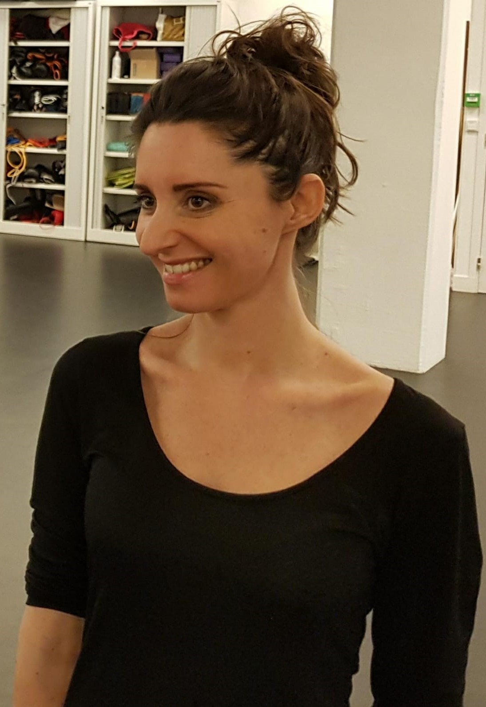

```{r setup, include=FALSE}
## Global options
knitr::opts_chunk$set(cache = TRUE)
```

Accueil {data-icon="fa-signal" #accueil}
===================================== 

Bienvenue sur le site de [Marine Olivari](#education).
--------------------------------------------------

Je donne des cours de danse Modern-Jazz et de [barre au sol](#floorbarre), mais également des cours de renforcement musculaire et stretching pour adultes de tous niveaux.

Les cours collectifs ont lieu sur Zoom ou au [Studio Cambronne]((https://www.studiocambronne.com/enseignants/marine_olivari.html)) situé [71 Rue Fondary, 75015 Paris](https://goo.gl/maps/Ayt4KuaAHZLjuoz36).

Je donne aussi des cours particuliers sur demande, [me contacter](#contact)

Rendez-vous sur l'onglet [Horaires et tarifs](#horaires) trouver l'ensemble des horaires et tarifs pour mes cours réguliers.

Portrait
--------------------------------------------------


